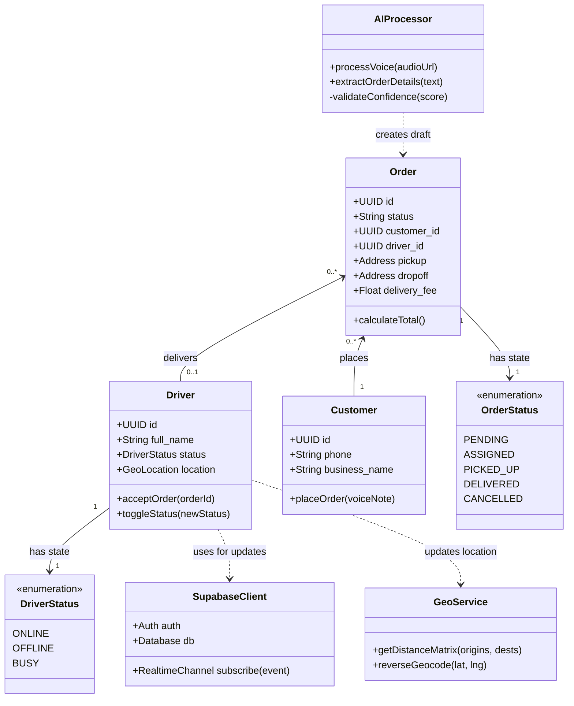

# Code Diagram (UML Class Diagram)

This diagram visualizes the internal code structure, showing the primary Classes, Interfaces, and Enums used in the TypeScript codebase.

```mermaid
classDiagram
    %% Core Entities (shared/src/schemas)
    class Order {
        +UUID id
        +String status
        +UUID customer_id
        +UUID driver_id
        +Address pickup
        +Address dropoff
        +Float delivery_fee
        +calculateTotal()
    }

    class Driver {
        +UUID id
        +String full_name
        +DriverStatus status
        +GeoLocation location
        +acceptOrder(orderId)
        +toggleStatus(newStatus)
    }

    class Customer {
        +UUID id
        +String phone
        +String business_name
        +placeOrder(voiceNote)
    }

    %% Enums
    class OrderStatus {
        <<enumeration>>
        PENDING
        ASSIGNED
        PICKED_UP
        DELIVERED
        CANCELLED
    }

    class DriverStatus {
        <<enumeration>>
        ONLINE
        OFFLINE
        BUSY
    }

    %% Services (Logic Layer)
    class SupabaseClient {
        +Auth auth
        +Database db
        +RealtimeChannel subscribe(event)
    }

    class AIProcessor {
        +processVoice(audioUrl)
        +extractOrderDetails(text)
        -validateConfidence(score)
    }

    class GeoService {
        +getDistanceMatrix(origins, dests)
        +reverseGeocode(lat, lng)
    }

    %% Relationships
    Order "1" --> "1" OrderStatus : has state
    Driver "1" --> "1" DriverStatus : has state
    Order "0..*" <-- "1" Customer : places
    Order "0..*" <-- "0..1" Driver : delivers
    
    Driver ..> SupabaseClient : uses for updates
    AIProcessor ..> Order : creates draft
    Driver ..> GeoService : updates location
```
