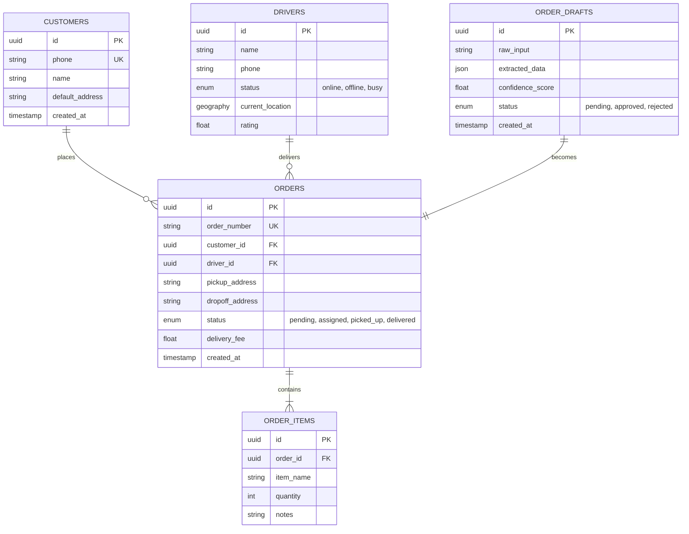

# Entity Relationship Diagram (ERD)

The ERD visualizes the normalized database schema designed for the Order Automation System in PostgreSQL (Supabase).

```mermaid
erDiagram
    CUSTOMERS ||--o{ ORDERS : places
    DRIVERS ||--o{ ORDERS : delivers
    ORDERS ||--|{ ORDER_ITEMS : contains
    ORDER_DRAFTS ||--|| ORDERS : becomes
    
    CUSTOMERS {
        uuid id PK
        string phone UK
        string name
        string default_address
        timestamp created_at
    }

    DRIVERS {
        uuid id PK
        string name
        string phone
        enum status "online, offline, busy"
        geography current_location
        float rating
    }

    ORDER_DRAFTS {
        uuid id PK
        string raw_input
        json extracted_data
        float confidence_score
        enum status "pending, approved, rejected"
        timestamp created_at
    }

    ORDERS {
        uuid id PK
        string order_number UK
        uuid customer_id FK
        uuid driver_id FK
        string pickup_address
        string dropoff_address
        enum status "pending, assigned, picked_up, delivered"
        float delivery_fee
        timestamp created_at
    }

    ORDER_ITEMS {
        uuid id PK
        uuid order_id FK
        string item_name
        int quantity
        string notes
    }
```
