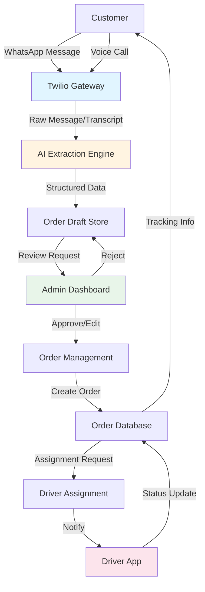
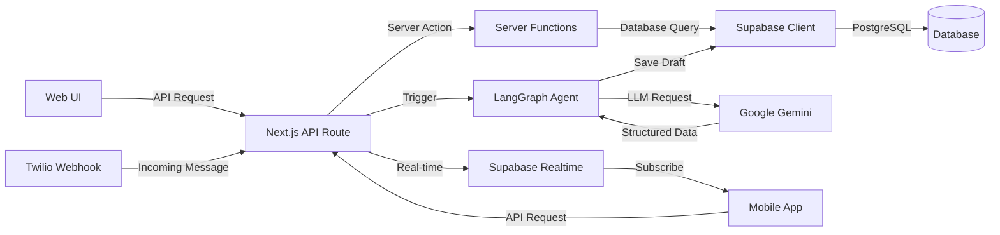
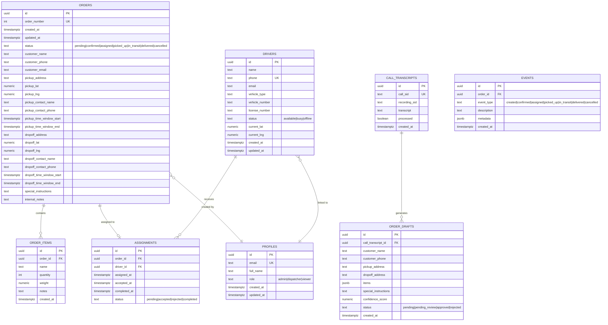

# Order Automation System

## Final Year Project Documentation

---

## Table of Contents

1. [Introduction](#1-introduction)
   - 1.1 [Problem Statement](#11-problem-statement)
   - 1.2 [Objectives](#12-objectives)
   - 1.3 [Scope of the Project](#13-scope-of-the-project)
   - 1.4 [Significance of the Project](#14-significance-of-the-project)
   - 1.5 [Artificial Intelligence Features](#15-artificial-intelligence-features)
   - 1.6 [Project Deliverables](#16-project-deliverables)

2. [Domain Analysis](#2-domain-analysis)
   - 2.1 [Customer](#21-customer)
   - 2.2 [Stakeholders](#22-stakeholders)
   - 2.3 [Affected Groups with Social or Economic Impact](#23-affected-groups-with-social-or-economic-impact)
   - 2.4 [Dependencies / External Systems](#24-dependencies--external-systems)
   - 2.5 [Related Projects with Feature Comparison](#25-related-projects-with-feature-comparison)
   - 2.6 [Context Diagram](#26-context-diagram)
   - 2.7 [Data Flow Diagram Level 0](#27-data-flow-diagram-level-0)

3. [Requirements Analysis](#3-requirements-analysis)
   - 3.1 [List of Actors](#31-list-of-actors)
   - 3.2 [Product Backlog](#32-product-backlog)
   - 3.3 [Non-Functional Requirements](#33-non-functional-requirements)

4. [System Architecture](#4-system-architecture)
   - 4.1 [System Context Diagram](#41-system-context-diagram)
   - 4.2 [System Container Diagram](#42-system-container-diagram)
   - 4.3 [Component Diagram](#43-component-diagram)
   - 4.4 [ERD (Entity Relationship Diagram)](#44-erd-entity-relationship-diagram)
   - 4.5 [Data Dictionary](#45-data-dictionary)

---

## 1. Introduction

### 1.0 Background

The logistics and delivery industry forms the backbone of modern commerce, facilitating the movement of goods from businesses to consumers and between commercial entities. In Pakistan, this sector has experienced significant growth over the past decade, driven by the rapid expansion of e-commerce, changing consumer behaviors, and increasing urbanization. What was once dominated by traditional courier services has evolved into a dynamic ecosystem of on-demand delivery platforms, last-mile logistics providers, and integrated supply chain solutions.

Historically, the delivery and logistics industry in Pakistan operated primarily through manual, paper-based processes. Customers would call dispatch centers to place orders, customer service representatives would manually record details on paper forms or basic spreadsheets, and dispatchers would physically coordinate with drivers through phone calls or radio communication. This traditional model, while functional for small-scale operations, created numerous bottlenecks: frequent order transcription errors, inefficient driver routing, lack of real-time tracking, and limited scalability.

The advent of mobile technology and smartphone penetration in Pakistan (exceeding 50% by 2020) began transforming the industry. Companies like Bykea, Rider, and international players like Foodpanda introduced mobile-first delivery platforms that digitized certain aspects of the workflow. However, most of these solutions focused primarily on the customer-facing and driver-facing interfaces, leaving the critical order intake process largely manual. Small to medium-sized logistics companies, which form the majority of the market, continued to rely on phone calls and manual data entry for order processing.

Currently, the logistics industry in Pakistan faces a critical challenge: **the order intake bottleneck**. While technology has automated many downstream processes (driver tracking, digital payments, route optimization), the initial point of customer contact remains predominantly manual. Customers call dispatch centers, customer service agents manually transcribe order details—including pickup addresses, delivery addresses, item descriptions, and special instructions—into computer systems. This manual transcription process is time-consuming, error-prone, and labor-intensive.

The problem is particularly acute for logistics companies handling 50-500 daily deliveries. At this scale, maintaining a dedicated team of call center operators becomes financially burdensome, yet the volume is too high to manage reliably through ad-hoc manual processes. Transcription errors lead to failed deliveries, customer dissatisfaction, and operational inefficiencies. Misheard addresses, incorrectly recorded phone numbers, or misunderstood item quantities result in wasted driver trips, additional costs, and damage to business reputation.

Moreover, the Pakistani market presents unique challenges. The country has diverse linguistic patterns—customers may communicate in English, Urdu, Punjabi, or regional dialects, often mixing languages within a single conversation. Address formats lack standardization; customers might describe locations using local landmarks ("near the old mosque") rather than formal street addresses. Phone numbers follow multiple formats, and informal communication norms mean order details may be scattered across lengthy, conversational messages.

Globally, the integration of **Artificial Intelligence (AI)** into business processes has revolutionized industries by automating repetitive tasks, extracting insights from unstructured data, and enabling intelligent decision-making. Natural Language Processing (NLP), a subfield of AI, has made remarkable progress in recent years, with large language models like GPT-4, Google Gemini, and Claude demonstrating human-level understanding of text and speech. These models can comprehend context, extract structured information from conversational language, and handle variations in grammar, spelling, and phrasing.

In the logistics sector, AI has been applied to various domains: route optimization using machine learning algorithms, demand forecasting through predictive analytics, and warehouse automation using computer vision. However, the application of NLP for **automated order intake from natural language communications** remains relatively unexplored, especially in emerging markets like Pakistan.

**This project addresses this gap by developing an AI-powered Order Automation System** specifically designed for small to medium logistics companies in Pakistan. The system leverages state-of-the-art NLP technology (Google Gemini LLM integrated via LangChain) to automatically extract structured order information from unstructured customer communications received through WhatsApp messages and voice calls. By automating the order intake process, the system eliminates manual transcription, reduces errors, improves operational efficiency, and enables logistics companies to scale without proportionally increasing staffing costs.

The project sits at the intersection of several technological domains: **cloud computing** (using Vercel and Supabase for scalable infrastructure), **telecommunications** (Twilio API for WhatsApp Business and voice integration), **artificial intelligence** (Google Gemini for NLP), **full-stack web development** (Next.js and React), and **mobile application development** (React Native for the driver app). It represents a practical application of AI to solve a real-world business problem, demonstrating how emerging technologies can be adapted to address challenges specific to developing markets.

There is a clear need for such a system. Logistics companies currently face a choice between hiring additional staff to handle growing order volumes or limiting their growth due to operational constraints. Neither option is sustainable. An automated order intake system provides a third path: leveraging AI to handle the initial data extraction, while human operators focus on verification, exception handling, and customer service. This hybrid approach combines the efficiency of automation with the judgment and flexibility of human oversight.

The absence of automated order processing mechanisms results in multiple operational inefficiencies: staff spending hours each day on repetitive data entry, occasional duplicate orders when the same customer calls multiple times, inconsistent data formats making analysis difficult, and inability to handle order inquiries outside business hours. These inefficiencies translate directly into financial losses and competitive disadvantages.

An Order Automation System is essential for addressing these challenges. The proposed system will maintain a real-time record of all customer communications, automatically extract order details with confidence scoring, provide a user-friendly interface for draft verification and approval, seamlessly integrate with existing workflows through driver assignment and tracking features, and facilitate easy generation of operational reports and analytics.

### 1.1 Problem Statement

The traditional delivery and logistics industry faces significant challenges in Pakistan:

- **Manual Order Entry**: Customers call to place orders, requiring staff to manually transcribe details, leading to errors and delays
- **Communication Barriers**: Language variations, unclear audio, and human error result in incorrect order information
- **Inefficient Workflow**: Manual processes slow down order processing, affecting customer satisfaction
- **Resource Intensive**: Requires dedicated staff for call handling and data entry
- **Scalability Issues**: Manual systems cannot efficiently handle increased order volumes
- **Limited Accessibility**: Customers must call during business hours, restricting order placement

These issues result in operational inefficiencies, increased costs, and poor customer experience.

## 1.2 Objectives

The Order Automation System aims to achieve the following objectives:

1. **Automate Order Intake**: Enable customers to place orders via WhatsApp or voice calls with automatic processing
2. **AI-Powered Extraction**: Use artificial intelligence to extract order details from natural language messages and voice transcripts
3. **Reduce Human Error**: Minimize transcription errors through automated data extraction
4. **Improve Efficiency**: Streamline the order-to-delivery workflow with real-time tracking
5. **Enhance Scalability**: Handle high volumes of concurrent orders without proportional staff increase
6. **24/7 Availability**: Allow order placement at any time through automated channels
7. **Real-time Driver Assignment**: Optimize driver allocation based on location and availability
8. **Comprehensive Tracking**: Provide visibility into order status for all stakeholders

## 1.3 Scope of the Project

### In Scope

**Phase 1: Order Intake & Management**

- WhatsApp and voice call integration via Twilio
- AI-powered order extraction using Google Gemini
- Order draft review and approval interface
- Manual order creation for admin users
- Order status management (pending, confirmed, assigned, in transit, delivered)

**Phase 2: Driver Management**

- Driver profile management
- Order assignment to drivers
- Basic route tracking
- Driver mobile application for order acceptance and updates

**Phase 3: Analytics & Reporting**

- Order history and analytics
- Performance metrics
- Customer information management

### Out of Scope

- Payment processing and invoicing
- Inventory management
- Multi-warehouse/depot management
- Advanced route optimization algorithms
- Customer mobile application

## 1.4 Significance of the Project

This project addresses critical needs in the logistics industry:

### For Businesses

- **Cost Reduction**: Reduces staffing costs for order processing
- **Error Minimization**: AI extraction ensures accurate order details
- **Scalability**: Handles growth without linear cost increase
- **Competitive Advantage**: Faster, more reliable service delivery

### For Customers

- **Convenience**: Place orders via preferred channels (WhatsApp/Phone)
- **Speed**: Instant order processing and confirmation
- **Transparency**: Real-time order tracking and status updates
- **Accessibility**: 24/7 order placement capability

### For Drivers

- **Efficiency**: Clear order details and optimized assignments
- **Flexibility**: Mobile app for on-the-go order management
- **Transparency**: Clear delivery requirements and instructions

### Social Impact

- **Employment**: Creates opportunities for delivery drivers
- **Small Business Enablement**: Affordable logistics for small retailers
- **Environmental**: Optimized routing reduces fuel consumption

## 1.5 Artificial Intelligence Features

The system leverages cutting-edge AI technologies:

### 1. Natural Language Processing (NLP)

- **Technology**: Google Gemini (LangChain integration)
- **Capability**: Extracts structured order data from unstructured text/speech
- **Use Case**: Processes WhatsApp messages and voice call transcripts

**Example Input:**

```
"Hi, I need to send a package. My name is Ali Khan, phone 0321-1234567.
Pick up from House 45, DHA Phase 6, Lahore.
Deliver to Office 302, Johar Town Block B.
It's 2 boxes of documents and 1 laptop bag. Please handle with care."
```

**AI-Extracted Output:**

```json
{
  "customer_name": "Ali Khan",
  "customer_phone": "0321-1234567",
  "pickup_address": "House 45, DHA Phase 6, Lahore",
  "dropoff_address": "Office 302, Johar Town Block B",
  "items": [
    {"name": "boxes of documents", "quantity": 2},
    {"name": "laptop bag", "quantity": 1}
  ],
  "special_instructions": "Handle with care",
  "confidence_score": 0.92
}
```

### 2. Confidence Scoring

- Provides reliability metrics (0-100%) for extracted data
- Flags low-confidence extractions for human verification
- Improves accuracy through feedback loops

### 3. Context-Aware Processing

- Understands Pakistani context (addresses, phone formats)
- Handles colloquial language and informal speech
- Adapts to multiple languages (English, Urdu)

## 1.6 Project Deliverables

| Deliverable | Description | Status |
|-------------|-------------|--------|
| **Web Application** | Next.js dashboard for order and driver management | ✅ Completed |
| **Mobile App (Driver)** | React Native app for drivers | 🔧 Scaffold Created |
| **AI Integration** | LangGraph agent for order extraction | ✅ Completed |
| **Database Schema** | Supabase PostgreSQL database | ✅ Completed |
| **Twilio Integration** | WhatsApp and Voice call webhooks | ✅ Completed |
| **Authentication System** | Magic link email authentication | ✅ Completed |
| **Responsive UI** | Mobile and desktop interfaces | ✅ Completed |
| **Documentation** | System architecture and API docs | ✅ Completed |
| **Deployment Guide** | Production deployment instructions | 📝 Pending |
| **User Manual** | End-user and admin guides | 📝 Pending |

---

## 2. Domain Analysis

## 2.1 Customer

### Primary Customer Segment

**Small to Medium Logistics Companies in Pakistan**

**Characteristics:**

- 10-100 employees
- 50-500 daily deliveries
- Manual or semi-automated order processing
- Limited IT infrastructure
- Budget-conscious
- Fast-growing customer base

**Needs:**

- Affordable automation solution
- Easy integration with existing workflows
- Minimal training requirements
- Scalable to handle growth
- Reliable customer support

### Secondary Customer Segment

**E-commerce Retailers**

**Characteristics:**

- Online sellers needing delivery services
- Variable order volumes (seasonal spikes)
- Customer satisfaction focused
- Tech-savvy

**Needs:**

- Real-time order tracking
- API integration capabilities
- Bulk order management
- Customer communication tools

## 2.2 Stakeholders

| Stakeholder | Role | Interest | Influence |
|-------------|------|----------|-----------|
| **Business Owners** | Decision makers | ROI, efficiency, scalability | High |
| **Operations Managers** | System administrators | Daily operations, reliability | High |
| **Dispatchers** | Order processors | Ease of use, accuracy | Medium |
| **Drivers** | Delivery personnel | Clear instructions, fair assignments | Medium |
| **Customers** | End users | Convenience, transparency | High |
| **IT Team** | Technical support | System stability, integration | Medium |
| **Investors** | Funding providers | Market traction, growth | High |
| **Regulatory Bodies** | Compliance | Data protection, consumer rights | Low |

## 2.3 Affected Groups with Social or Economic Impact

### **Positive Impacts**

#### 1. Delivery Drivers

- **Employment Opportunities**: System enables companies to hire more drivers
- **Better Work Conditions**: Clear instructions reduce confusion and stress
- **Income Transparency**: Digital tracking ensures fair payment
- **Skill Development**: Exposure to mobile technology

#### 2. Small Retailers

- **Access to Logistics**: Affordable delivery services previously unavailable
- **Market Expansion**: Ability to serve customers in wider geographic areas
- **Cost Savings**: Reduced need for in-house delivery teams
- **Competitiveness**: Level playing field with larger competitors

#### 3. Consumers

- **Convenience**: Easy order tracking and communication
- **Reliability**: Reduced errors and delays
- **Transparency**: Real-time status updates
- **Cost Savings**: Efficient operations may reduce delivery fees

#### 4. Environment

- **Reduced Emissions**: Route optimization decreases fuel consumption
- **Paperwork Reduction**: Digital records eliminate paper forms
- **Resource Efficiency**: Better planning reduces wasted trips

### **Potential Negative Impacts & Mitigation**

#### 1. Job Displacement

- **Risk**: Automation may reduce need for call center staff
- **Mitigation**:
  - Retrain staff for customer support roles
  - Focus on value-added services (quality control, relationship management)
  - Gradual transition timeline

#### 2. Digital Divide

- **Risk**: Non-tech-savvy users may face barriers
- **Mitigation**:
  - Maintain phone call option alongside WhatsApp
  - Simple, intuitive interfaces
  - Multi-language support
  - Training programs for users

#### 3. Data Privacy

- **Risk**: Customer data collection and storage
- **Mitigation**:
  - Encryption at rest and in transit
  - GDPR-compliant data handling
  - Clear privacy policies
  - Regular security audits

## 2.4 Dependencies / External Systems

### **Critical Dependencies**

#### 1. Twilio Communication Platform

- **Purpose**: WhatsApp Business API, Voice calls, SMS
- **Integration**: Webhooks for incoming messages and calls
- **SLA**: 99.95% uptime
- **Fallback**: Manual order entry if service disrupted
- **Cost**: Pay-per-message pricing

#### 2. Google Gemini (LLM)

- **Purpose**: AI-powered order extraction from natural language
- **Integration**: LangChain framework via API
- **SLA**: Best-effort (no guaranteed uptime)
- **Fallback**: Queue failed extractions for manual processing
- **Cost**: Token-based pricing

#### 3. Supabase (Database & Auth)

- **Purpose**: PostgreSQL database, Authentication, Real-time subscriptions
- **Integration**: REST API and PostgreSQL client
- **SLA**: 99.9% uptime (paid tier)
- **Fallback**: Database backups, read replicas
- **Cost**: Based on database size and API requests

#### 4. Vercel (Hosting)

- **Purpose**: Web application deployment and CDN
- **Integration**: Git-based deployment
- **SLA**: 99.99% uptime
- **Fallback**: Can migrate to AWS/GCP if needed
- **Cost**: Based on bandwidth and build minutes

### **Optional Dependencies**

| Service | Purpose | Alternative |
|---------|---------|-------------|
| **Google Maps API** | Geocoding, distance calculation | OpenStreetMap |
| **Sentry** | Error tracking and monitoring | CloudWatch |
| **Stripe** | Payment processing (future) | PayPal, local gateways |
| **SendGrid** | Transactional emails | AWS SES |

### **Development Dependencies**

- **GitHub**: Version control and CI/CD
- **npm Registry**: Package management
- **Turborepo**: Monorepo build system
- **Next.js**: Web framework
- **React Native**: Mobile framework

## 2.5 Related Projects with Feature Comparison

### 2.5.1 Related Projects

#### 1. **TCS Express**

- **Type**: Full-service courier company
- **Strengths**: Nationwide network, established brand
- **Weaknesses**: Manual processes, expensive for small businesses
- **Target**: Enterprise clients

#### 2. **Leopards Courier**

- **Type**: Courier and logistics service
- **Strengths**: Fast delivery, good coverage
- **Weaknesses**: Limited automation, high minimum volumes
- **Target**: E-commerce businesses

#### 3. **Postmates (International)**

- **Type**: On-demand delivery platform
- **Strengths**: Real-time tracking, mobile-first
- **Weaknesses**: Not available in Pakistan
- **Target**: Food and retail deliveries

#### 4. **Bykea**

- **Type**: Ride-hailing and delivery app
- **Strengths**: Local market knowledge, affordable
- **Weaknesses**: Limited to urban areas, no B2B focus
- **Target**: Consumer deliveries

### 2.5.2 Feature Comparison

| Feature | Our System | TCS | Leopards | Postmates | Bykea |
|---------|------------|-----|----------|-----------|-------|
| **AI Order Extraction** | ✅ | ❌ | ❌ | ❌ | ❌ |
| **WhatsApp Integration** | ✅ | ❌ | ❌ | ❌ | ❌ |
| **Voice Call Processing** | ✅ | ❌ | ❌ | ❌ | ❌ |
| **Real-time Tracking** | ✅ | ✅ | ⚠️ | ✅ | ✅ |
| **Driver Mobile App** | 🔧 | ✅ | ✅ | ✅ | ✅ |
| **Web Dashboard** | ✅ | ✅ | ✅ | ✅ | ✅ |
| **API Access** | 🔜 | ✅ | ⚠️ | ✅ | ❌ |
| **Multi-city Coverage** | 🔜 | ✅ | ✅ | ✅ | ✅ |
| **Pricing** | Affordable | Premium | Moderate | Variable | Low |
| **Target Market** | SME Logistics | Enterprise | E-commerce | Consumers | Consumers |

**Legend:**

- ✅ Fully Available
- ⚠️ Partially Available
- 🔧 In Development
- 🔜 Planned
- ❌ Not Available

### **Competitive Advantages**

1. **AI-First Approach**: Only solution with intelligent order extraction
2. **Channel Flexibility**: WhatsApp + Voice + Manual entry
3. **Affordability**: Lower operational costs passed to customers
4. **Customizability**: Open architecture for business-specific workflows
5. **Modern Tech Stack**: Easier to integrate and extend

## 2.6 Context Diagram

```
┌──────────────────────────────────────────────────────────────────────┐
│                                                                      │
│                    ORDER AUTOMATION SYSTEM                           │
│                                                                      │
│  ┌────────────────────────────────────────────────────────────┐    │
│  │                                                            │    │
│  │    ┌──────────┐   ┌──────────┐   ┌──────────┐           │    │
│  │    │ WhatsApp │   │  Voice   │   │   Web    │           │    │
│  │    │ Gateway  │   │  Gateway │   │Dashboard │           │    │
│  │    └────┬─────┘   └────┬─────┘   └────┬─────┘           │    │
│  │         │              │              │                  │    │
│  │         └──────────────┴──────────────┘                  │    │
│  │                        │                                 │    │
│  │                ┌───────▼────────┐                        │    │
│  │                │  Order Intake  │                        │    │
│  │                │   AI Engine    │                        │    │
│  │                └───────┬────────┘                        │    │
│  │                        │                                 │    │
│  │                ┌───────▼────────┐                        │    │
│  │                │ Order Manager  │                        │    │
│  │                └───────┬────────┘                        │    │
│  │                        │                                 │    │
│  │         ┌──────────────┼──────────────┐                 │    │
│  │         │              │              │                 │    │
│  │    ┌────▼──────┐  ┌───▼─────┐  ┌────▼──────┐          │    │
│  │    │  Driver   │  │ Customer│  │ Analytics │          │    │
│  │    │ Assignment│  │  Mgmt   │  │  Engine   │          │    │
│  │    └────┬──────┘  └─────────┘  └───────────┘          │    │
│  │         │                                              │    │
│  │    ┌────▼──────┐                                       │    │
│  │    │  Database │                                       │    │
│  │    │(Supabase) │                                       │    │
│  │    └───────────┘                                       │    │
│  │                                                            │    │
│  └────────────────────────────────────────────────────────────┘    │
│                                                                      │
└──────────────────────────────────────────────────────────────────────┘
           │                  │                    │
           │                  │                    │
    ┌──────▼──────┐   ┌───────▼──────┐   ┌────────▼──────┐
    │  Customer   │   │     Admin    │   │    Driver     │
    │   (Sender)  │   │  (Dispatcher)│   │ (Mobile App)  │
    └─────────────┘   └──────────────┘   └───────────────┘
```

### **External Actors**

- **Customer**: Places orders via WhatsApp, voice calls, or web
- **Admin/Dispatcher**: Reviews and manages orders via web dashboard
- **Driver**: Receives and updates orders via mobile app

### **External Systems**

- **Twilio**: Handles WhatsApp and voice communications
- **Google Gemini**: Processes natural language for order extraction
- **Supabase**: Provides database, auth, and real-time features

## 2.7 Data Flow Diagram Level 0



### **Process Descriptions**

| Process | Description | Input | Output |
|---------|-------------|-------|--------|
| **P1: Receive Order** | Twilio receives WhatsApp/call and triggers webhook | Customer message/call | Raw text/transcript |
| **P2: Extract Data** | AI analyzes text and extracts order details | Raw message | Structured order data + confidence score |
| **P3: Create Draft** | System stores extracted data as pending draft | Order data | Draft ID |
| **P4: Review Draft** | Admin reviews and corrects AI extraction | Draft data | Approved/Rejected status |
| **P5: Create Order** | Convert approved draft to active order | Validated data | Order ID |
| **P6: Assign Driver** | System assigns driver based on availability/location | Order details | Assignment ID |
| **P7: Update Status** | Driver updates order status via mobile app | Status code | Notification to customer |

### **Data Stores**

| Store | Description | Key Data |
|-------|-------------|----------|
| **D1: call_transcripts** | Raw message/call data | message, transcript, call_sid |
| **D2: order_drafts** | AI-extracted pending orders | customer, addresses, items, confidence |
| **D3: orders** | Confirmed active orders | order_number, status, timestamps |
| **D4: drivers** | Driver profiles | name, phone, vehicle, status |
| **D5: assignments** | Order-driver mappings | order_id, driver_id, status |

---

## 3. Requirements Analysis

## 3.1 List of Actors

| Actor | Description | Responsibilities |
|-------|-------------|------------------|
| **Customer** | Person or business placing delivery order | • Send order via WhatsApp/voice<br>• Provide pickup/delivery details<br>• Track order status |
| **Admin/Dispatcher** | Operations staff managing orders | • Review AI-extracted drafts<br>• Manually create orders<br>• Assign drivers<br>• Monitor system |
| **Driver** | Delivery personnel | • View assigned orders<br>• Update order status<br>• Navigate to addresses<br>• Confirm deliveries |
| **System** | Automated processes | • Extract order data via AI<br>• Send notifications<br>• Calculate routes<br>• Generate reports |
| **Business Owner** | Company decision maker | • View analytics<br>• Manage users<br>• Configure system settings |

## 3.2 Product Backlog

### Epic 1: Order Intake & Processing

#### User Story 1.1: WhatsApp Order Placement

**As a** customer  
**I want to** send my order details via WhatsApp  
**So that** I can place orders conveniently without calling

**Acceptance Criteria:**

- Customer can send text message to Twilio WhatsApp number
- System receives message and stores in database
- AI extracts order details within 5 seconds
- Customer receives confirmation message
- Confidence score is calculated and stored

**Priority:** High  
**Story Points:** 8  
**Status:** ✅ Completed

---

#### User Story 1.2: Voice Call Order Placement

**As a** customer  
**I want to** place orders via phone call  
**So that** I can provide details verbally

**Acceptance Criteria:**

- Customer can call Twilio phone number
- Call is recorded and transcribed
- Transcription is processed by AI
- System handles multiple concurrent calls
- Transcription accuracy >85%

**Priority:** Medium  
**Story Points:** 8  
**Status:** ✅ Completed

---

#### User Story 1.3: AI Order Extraction

**As a** system  
**I want to** extract structured order data from unstructured text  
**So that** manual data entry is eliminated

**Acceptance Criteria:**

- Extract customer name, phone, addresses, items
- Handle informal language and typos
- Support English and Urdu
- Provide confidence score (0-100%)
- Process extraction in <3 seconds

**Priority:** High  
**Story Points:** 13  
**Status:** ✅ Completed

---

#### User Story 1.4: Draft Review Interface

**As an** admin  
**I want to** review AI-extracted orders before confirmation  
**So that** I can correct any errors

**Acceptance Criteria:**

- Display all pending drafts in a list
- Show confidence score with color coding
- Allow editing of all fields
- Option to approve or reject
- Mobile-responsive interface

**Priority:** High  
**Story Points:** 8  
**Status:** ✅ Completed

---

### Epic 2: Order Management

#### User Story 2.1: Manual Order Creation

**As an** admin  
**I want to** manually create orders  
**So that** I can handle orders from other channels

**Acceptance Criteria:**

- Form with customer, pickup, delivery fields
- Validation of required fields
- Support for multiple items
- Save draft or submit directly
- Auto-generate order number

**Priority:** High  
**Story Points:** 5  
**Status:** ✅ Completed

---

#### User Story 2.2: Order List View

**As an** admin  
**I want to** see all orders in a list  
**So that** I can monitor operations

**Acceptance Criteria:**

- Display orders with key details
- Filter by status (pending, in transit, delivered)
- Search by customer name or order number
- Pagination for large datasets
- Real-time updates

**Priority:** High  
**Story Points:** 5  
**Status:** ✅ Completed

---

#### User Story 2.3: Order Status Update

**As an** admin  
**I want to** update order status  
**So that** I can track progress

**Acceptance Criteria:**

- Update status via dropdown
- Allowed transitions: pending→confirmed→assigned→picked_up→in_transit→delivered
- Prevent invalid status changes
- Log status change history
- Trigger notifications

**Priority:** High  
**Story Points:** 5  
**Status:** 🔧 Partial

---

### Epic 3: Driver Management

#### User Story 3.1: Driver Registration

**As an** admin  
**I want to** register new drivers  
**So that** they can be assigned orders

**Acceptance Criteria:**

- Form with name, phone, vehicle details
- Upload driver photo and license
- Set initial status (available/offline)
- Validate unique phone number
- Send welcome notification

**Priority:** High  
**Story Points:** 5  
**Status:** 📝 Planned

---

#### User Story 3.2: Driver Assignment

**As an** admin  
**I want to** assign orders to drivers  
**So that** deliveries can be executed

**Acceptance Criteria:**

- Select driver from available list
- Show driver location and current load
- Prevent double-assignment
- Notify driver via mobile app
- Log assignment history

**Priority:** High  
**Story Points:** 8  
**Status:** 🔧 Partial

---

#### User Story 3.3: Driver Mobile App

**As a** driver  
**I want to** use a mobile app  
**So that** I can manage my assigned orders

**Acceptance Criteria:**

- View assigned orders
- Navigate to pickup/delivery addresses
- Update order status (picked up, delivered)
- Capture delivery proof (signature/photo)
- Call customer directly

**Priority:** High  
**Story Points:** 13  
**Status:** 🔧 Scaffold Created

---

### Epic 4: Notifications & Communication

#### User Story 4.1: Order Confirmation Message

**As a** customer  
**I want to** receive confirmation after placing order  
**So that** I know my request was received

**Acceptance Criteria:**

- Send confirmation via WhatsApp
- Include order number and estimated time
- Support SMS fallback
- Delivery within 10 seconds
- Track send status

**Priority:** Medium  
**Story Points:** 3  
**Status:** ✅ Completed (WhatsApp)

---

#### User Story 4.2: Status Update Notifications

**As a** customer  
**I want to** receive updates when order status changes  
**So that** I can track my delivery

**Acceptance Criteria:**

- Notify on: confirmed, driver assigned, picked up, in transit, delivered
- Send via WhatsApp or SMS
- Include tracking link
- Allow user to opt-out
- Log notification history

**Priority:** Medium  
**Story Points:** 5  
**Status:** 📝 Planned

---

### Epic 5: Analytics & Reporting

#### User Story 5.1: Order Analytics Dashboard

**As a** business owner  
**I want to** view order statistics  
**So that** I can monitor business performance

**Acceptance Criteria:**

- Show total orders, revenue, completion rate
- Breakdown by status and time period
- Visualize trends with charts
- Export data to CSV
- Real-time updates

**Priority:** Medium  
**Story Points:** 8  
**Status:** 📝 Planned

---

#### User Story 5.2: Driver Performance Reports

**As a** business owner  
**I want to** see driver performance metrics  
**So that** I can identify top performers

**Acceptance Criteria:**

- Deliveries per driver
- Average delivery time
- Customer ratings
- Filter by date range
- Compare drivers side-by-side

**Priority:** Low  
**Story Points:** 5  
**Status:** 📝 Planned

---

## 3.3 Non-Functional Requirements

### Performance

| ID | Requirement | Target | Measurement |
|----|-------------|---------|-------------|
| NFR-P1 | Order extraction speed | <3 seconds | 95th percentile |
| NFR-P2 | Page load time | <2 seconds | Average (3G network) |
| NFR-P3 | Database query response | <200ms | 99th percentile |
| NFR-P4 | Concurrent orders processing | 100/minute | Sustained load |
| NFR-P5 | API response time | <500ms | 95th percentile |

### Scalability

| ID | Requirement | Target |
|----|-------------|--------|
| NFR-S1 | Support 10,000 orders/day | Within 6 months |
| NFR-S2 | 100 concurrent users | Simultaneous access |
| NFR-S3 | 500 active drivers | System capacity |
| NFR-S4 | Horizontal scaling | Auto-scale to 10 instances |

### Reliability

| ID | Requirement | Target |
|----|-------------|--------|
| NFR-R1 | System uptime | 99.9% (43min downtime/month) |
| NFR-R2 | Data backup frequency | Every 1 hour |
| NFR-R3 | Disaster recovery time | <4 hours |
| NFR-R4 | AI extraction success rate | >90% |
| NFR-R5 | Message delivery success | >99% |

### Security

| ID | Requirement | Description |
|----|-------------|-------------|
| NFR-SE1 | Data encryption | AES-256 at rest, TLS 1.3 in transit |
| NFR-SE2 | Authentication | Magic link email + session tokens |
| NFR-SE3 | Authorization | Role-based access control (RBAC) |
| NFR-SE4 | API security | Rate limiting (100 req/min per IP) |
| NFR-SE5 | Data privacy | GDPR-compliant data handling |
| NFR-SE6 | Audit logging | All user actions logged for 90 days |

### Usability

| ID | Requirement | Description |
|----|-------------|-------------|
| NFR-U1 | Learning curve | New users productive within 15 minutes |
| NFR-U2 | Mobile responsiveness | Fully functional on screens ≥360px |
| NFR-U3 | Multi-language support | English, Urdu |
| NFR-U4 | Accessibility | WCAG 2.1 Level AA compliance |
| NFR-U5 | Error messages | Clear, actionable error descriptions |

### Maintainability

| ID | Requirement | Description |
|----|-------------|-------------|
| NFR-M1 | Code documentation | 100% of public APIs documented |
| NFR-M2 | Test coverage | >80% unit test coverage |
| NFR-M3 | Deployment frequency | Weekly releases |
| NFR-M4 | Rollback capability | <5 minute rollback time |
| NFR-M5 | Monitoring | Real-time error tracking (Sentry) |

### Compatibility

| ID | Requirement | Support |
|----|-------------|---------|
| NFR-C1 | Browsers | Chrome 90+, Firefox 88+, Safari 14+, Edge 90+ |
| NFR-C2 | Mobile OS | iOS 13+, Android 8+ |
| NFR-C3 | Screen sizes | 360px - 4K resolution |
| NFR-C4 | Network conditions | Works on 3G networks |

---

## 4. System Architecture

## 4.1 System Context Diagram

```
┌─────────────────────────────────────────────────────────────────────┐
│                                                                     │
│                          EXTERNAL WORLD                             │
│                                                                     │
│   ┌──────────┐       ┌──────────┐       ┌──────────┐            │
│   │ Customer │       │  Admin   │       │  Driver  │            │
│   └─────┬────┘       └─────┬────┘       └─────┬────┘            │
│         │                  │                  │                   │
│         │ WhatsApp         │ HTTPS           │ HTTPS            │
│         │ Voice            │                  │                   │
│         ▼                  ▼                  ▼                   │
│   ┌─────────────────────────────────────────────────────┐        │
│   │                                                     │        │
│   │         ORDER AUTOMATION SYSTEM                     │        │
│   │                                                     │        │
│   │   ┌─────────────┐  ┌──────────────┐  ┌──────────┐ │        │
│   │   │    Web      │  │    Mobile    │  │   API    │ │        │
│   │   │ Application │  │  App (Driver)│  │ Services │ │        │
│   │   └─────────────┘  └──────────────┘  └──────────┘ │        │
│   │                                                     │        │
│   └─────────────────────────────────────────────────────┘        │
│         │                  │                  │                   │
└─────────┼──────────────────┼──────────────────┼───────────────────┘
          │                  │                  │
          ▼                  ▼                  ▼
    ┌─────────┐        ┌─────────┐        ┌──────────┐
    │ Twilio  │        │ Google  │        │ Supabase │
    │(Webhook)│        │ Gemini  │        │ (DB+Auth)│
    └─────────┘        └─────────┘        └──────────┘
```

## 4.2 System Container Diagram

```
┌───────────────────────────────────────────────────────────────────┐
│                      Order Automation System                      │
│                                                                   │
│  ┌────────────────────────────────────────────────────────────┐  │
│  │               Frontend Layer                                │  │
│  │  ┌──────────────┐              ┌──────────────┐           │  │
│  │  │   Web App    │              │  Mobile App  │           │  │
│  │  │   (Next.js)  │              │(React Native)│           │  │
│  │  │              │              │              │           │  │
│  │  │ - Dashboard  │              │ - Order List │           │  │
│  │  │ - Orders     │              │ - Navigation │           │  │
│  │  │ - Drafts     │              │ - Updates    │           │  │
│  │  │ - Drivers    │              │              │           │  │
│  │  └──────┬───────┘              └──────┬───────┘           │  │
│  │         │                             │                    │  │
│  └─────────┼─────────────────────────────┼────────────────────┘  │
│            │              │              │                        │
│            ▼              ▼              ▼                        │
│  ┌────────────────────────────────────────────────────────────┐  │
│  │               Backend Layer                                 │  │
│  │                                                            │  │
│  │  ┌────────────────────────────────────────────────────┐   │  │
│  │  │           API Routes (Next.js)                     │   │  │
│  │  │  /api/orders  /api/drafts  /api/drivers          │   │  │
│  │  │  /api/twilio/whatsapp  /api/twilio/voice         │   │  │
│  │  └──────────────────┬─────────────────────────────────┘   │  │
│  │                     │                                      │  │
│  │  ┌──────────────────▼──────────────┐                      │  │
│  │  │     Server Actions              │                      │  │
│  │  │  - approveDraft()              │                      │  │
│  │  │  - rejectDraft()               │                      │  │
│  │  │  - assignDriver()              │                      │  │
│  │  └──────────────────┬──────────────┘                      │  │
│  │                     │                                      │  │
│  └─────────────────────┼──────────────────────────────────────┘  │
│                        │                                          │
│  ┌─────────────────────▼──────────────────────────────────────┐  │
│  │               AI Processing Layer                          │  │
│  │                                                            │  │
│  │  ┌──────────────────────────────────────────────┐         │  │
│  │  │      LangGraph Agent (packages/langgraph)    │         │  │
│  │  │                                               │         │  │
│  │  │  ┌─────────────────────────────────────┐    │         │  │
│  │  │  │  Extract Order Node                 │    │         │  │
│  │  │  │  - Gemini LLM Integration           │    │         │  │
│  │  │  │  - JSON Parsing & Validation        │    │         │  │
│  │  │  │  - Confidence Scoring               │    │         │  │
│  │  │  └─────────────────────────────────────┘    │         │  │
│  │  │                                               │         │  │
│  │  └───────────────────┬───────────────────────────┘         │  │
│  │                      │                                      │  │
│  └──────────────────────┼──────────────────────────────────────┘  │
│                         │                                          │
│  ┌──────────────────────▼──────────────────────────────────────┐  │
│  │               Data Layer                                    │  │
│  │                                                             │  │
│  │  ┌───────────────┐  ┌─────────────┐  ┌────────────────┐   │  │
│  │  │   PostgreSQL  │  │   Storage   │  │  Real-time     │   │  │
│  │  │   (Supabase)  │  │   (S3)      │  │  Subscriptions │   │  │
│  │  │               │  │             │  │   (Supabase)   │   │  │
│  │  └───────────────┘  └─────────────┘  └────────────────┘   │  │
│  │                                                             │  │
│  └─────────────────────────────────────────────────────────────┘  │
│                                                                   │
└───────────────────────────────────────────────────────────────────┘
```

## 4.3 Component Diagram

### Web Application Components

```
apps/web/
├── src/
│   ├── app/
│   │   ├── (root)/
│   │   │   ├── dashboard/          # Dashboard overview
│   │   │   ├── drafts/             # Order drafts list & review
│   │   │   ├── orders/             # Orders management
│   │   │   ├── drivers/            # Driver management
│   │   │   └── customers/          # Customer profiles
│   │   ├── api/
│   │   │   ├── orders/             # Order CRUD endpoints
│   │   │   ├── drafts/             # Draft management
│   │   │   ├── twilio/
│   │   │   │   ├── whatsapp/       # WhatsApp webhook
│   │   │   │   ├── voice/          # Voice call webhook
│   │   │   │   └── transcription/  # Transcription callback
│   │   │   └── process-calls/      # Batch processing
│   │   └── actions/
│   │       ├── drafts.ts           # Server Actions (approve/reject)
│   │       └── orders.ts           # Order actions
│   ├── components/
│   │   ├── layout/
│   │   │   └── Sidebar.tsx         # Navigation sidebar
│   │   ├── drafts/
│   │   │   ├── DraftCard.tsx       # Draft display card
│   │   │   └── ReviewDialog.tsx    # Draft review form
│   │   └── ui/                     # Reusable UI components
│   └── hooks/
│       └── use-media-query.ts      # Responsive hooks
```

### Shared Packages

```
packages/
├── ui/                             # Shared UI components (shadcn)
├── shared/
│   ├── src/
│   │   ├── api/
│   │   │   ├── hooks/              # React Query hooks
│   │   │   │   ├── use-orders.ts
│   │   │   │   └── use-drivers.ts
│   │   │   └── api-client.ts       # Axios instance
│   │   ├── schemas/
│   │   │   └── order.ts            # Zod validation schemas
│   │   ├── supabase/
│   │   │   ├── client.ts           # Browser client
│   │   │   ├── server.ts           # Server client
│   │   │   └── middleware.ts       # Auth middleware
│   │   └── types/
│   │       └── index.ts            # TypeScript types
└── langgraph/
    ├── src/
    │   ├── graph.ts                # LangGraph workflow
    │   ├── state.ts                # State definition
    │   ├── model.ts                # Gemini client
    │   └── nodes/
    │       └── extract-order.ts    # Extraction logic
```

### Component Interactions



## 4.4 ERD (Entity Relationship Diagram)



## 4.5 Data Dictionary

### Table: `orders`

| Column | Type | Constraints | Description |
|--------|------|-------------|-------------|
| `id` | UUID | PRIMARY KEY, DEFAULT gen_random_uuid() | Unique order identifier |
| `order_number` | INTEGER | UNIQUE, AUTO INCREMENT | Human-readable order number |
| `created_at` | TIMESTAMPTZ | DEFAULT now() | Order creation timestamp |
| `updated_at` | TIMESTAMPTZ | DEFAULT now() | Last update timestamp |
| `status` | TEXT | CHECK (pending\|confirmed\|assigned\|picked_up\|in_transit\|delivered\|cancelled) | Current order status |
| `customer_name` | TEXT | NOT NULL | Customer full name |
| `customer_phone` | TEXT | NOT NULL | Customer phone number |
| `customer_email` | TEXT | NULLABLE | Customer email address |
| `pickup_address` | TEXT | NOT NULL | Full pickup address |
| `pickup_lat` | NUMERIC | NULLABLE | Pickup latitude |
| `pickup_lng` | NUMERIC | NULLABLE | Pickup longitude |
| `pickup_contact_name` | TEXT | NULLABLE | Pickup location contact person |
| `pickup_contact_phone` | TEXT | NULLABLE | Pickup location phone |
| `pickup_time_window_start` | TIMESTAMPTZ | NULLABLE | Earliest pickup time |
| `pickup_time_window_end` | TIMESTAMPTZ | NULLABLE | Latest pickup time |
| `dropoff_address` | TEXT | NOT NULL | Full delivery address |
| `dropoff_lat` | NUMERIC | NULLABLE | Delivery latitude |
| `dropoff_lng` | NUMERIC | NULLABLE | Delivery longitude |
| `dropoff_contact_name` | TEXT | NULLABLE | Delivery location contact |
| `dropoff_contact_phone` | TEXT | NULLABLE | Delivery location phone |
| `dropoff_time_window_start` | TIMESTAMPTZ | NULLABLE | Earliest delivery time |
| `dropoff_time_window_end` | TIMESTAMPTZ | NULLABLE | Latest delivery time |
| `special_instructions` | TEXT | NULLABLE | Customer delivery instructions |
| `internal_notes` | TEXT | NULLABLE | Admin-only notes |

### Table: `order_items`

| Column | Type | Constraints | Description |
|--------|------|-------------|-------------|
| `id` | UUID | PRIMARY KEY | Item identifier |
| `order_id` | UUID | FOREIGN KEY → orders(id) ON DELETE CASCADE | Parent order |
| `name` | TEXT | NOT NULL | Item description |
| `quantity` | INTEGER | DEFAULT 1 | Quantity |
| `weight` | NUMERIC | NULLABLE | Item weight (kg) |
| `notes` | TEXT | NULLABLE | Item-specific notes |
| `created_at` | TIMESTAMPTZ | DEFAULT now() | Creation timestamp |

### Table: `order_drafts`

| Column | Type | Constraints | Description |
|--------|------|-------------|-------------|
| `id` | UUID | PRIMARY KEY | Draft identifier |
| `call_transcript_id` | UUID | FOREIGN KEY → call_transcripts(id) | Source transcript |
| `customer_name` | TEXT | NULLABLE | AI-extracted customer name |
| `customer_phone` | TEXT | NULLABLE | AI-extracted phone |
| `pickup_address` | TEXT | NULLABLE | AI-extracted pickup |
| `dropoff_address` | TEXT | NULLABLE | AI-extracted dropoff |
| `items` | JSONB | NULLABLE | AI-extracted items array |
| `special_instructions` | TEXT | NULLABLE | AI-extracted instructions |
| `confidence_score` | NUMERIC | NULLABLE, CHECK (0-1) | AI confidence level |
| `status` | TEXT | CHECK (pending\|pending_review\|approved\|rejected) | Review status |
| `created_at` | TIMESTAMPTZ | DEFAULT now() | Creation timestamp |

### Table: `call_transcripts`

| Column | Type | Constraints | Description |
|--------|------|-------------|-------------|
| `id` | UUID | PRIMARY KEY | Transcript identifier |
| `call_sid` | TEXT | UNIQUE | Twilio call/message SID |
| `recording_sid` | TEXT | NULLABLE | Twilio recording SID |
| `transcript` | TEXT | NULLABLE | Transcribed text |
| `processed` | BOOLEAN | DEFAULT false | AI processing status |
| `created_at` | TIMESTAMPTZ | DEFAULT now() | Received timestamp |

### Table: `drivers`

| Column | Type | Constraints | Description |
|--------|------|-------------|-------------|
| `id` | UUID | PRIMARY KEY | Driver identifier |
| `name` | TEXT | NOT NULL | Driver full name |
| `phone` | TEXT | UNIQUE, NOT NULL | Driver phone number |
| `email` | TEXT | NULLABLE | Driver email |
| `vehicle_type` | TEXT | NULLABLE | Vehicle category (bike/car/van) |
| `vehicle_number` | TEXT | NULLABLE | License plate number |
| `license_number` | TEXT | NULLABLE | Driver license number |
| `status` | TEXT | CHECK (available\|busy\|offline) | Current availability |
| `current_lat` | NUMERIC | NULLABLE | Last known latitude |
| `current_lng` | NUMERIC | NULLABLE | Last known longitude |
| `created_at` | TIMESTAMPTZ | DEFAULT now() | Registration timestamp |
| `updated_at` | TIMESTAMPTZ | DEFAULT now() | Last update timestamp |

### Table: `assignments`

| Column | Type | Constraints | Description |
|--------|------|-------------|-------------|
| `id` | UUID | PRIMARY KEY | Assignment identifier |
| `order_id` | UUID | FOREIGN KEY → orders(id) | Assigned order |
| `driver_id` | UUID | FOREIGN KEY → drivers(id) | Assigned driver |
| `assigned_at` | TIMESTAMPTZ | DEFAULT now() | Assignment timestamp |
| `accepted_at` | TIMESTAMPTZ | NULLABLE | Driver acceptance timestamp |
| `completed_at` | TIMESTAMPTZ | NULLABLE | Completion timestamp |
| `status` | TEXT | CHECK (pending\|accepted\|rejected\|completed) | Assignment status |

### Table: `events`

| Column | Type | Constraints | Description |
|--------|------|-------------|-------------|
| `id` | UUID | PRIMARY KEY | Event identifier |
| `order_id` | UUID | FOREIGN KEY → orders(id) | Related order |
| `event_type` | TEXT | NOT NULL | Event category |
| `description` | TEXT | NULLABLE | Event description |
| `metadata` | JSONB | NULLABLE | Additional event data |
| `created_at` | TIMESTAMPTZ | DEFAULT now() | Event timestamp |

### Table: `profiles`

| Column | Type | Constraints | Description |
|--------|------|-------------|-------------|
| `id` | UUID | PRIMARY KEY, FOREIGN KEY → auth.users(id) | User identifier |
| `email` | TEXT | UNIQUE | User email |
| `full_name` | TEXT | NULLABLE | User full name |
| `role` | TEXT | CHECK (admin\|dispatcher\|viewer) | Access level |
| `created_at` | TIMESTAMPTZ | DEFAULT now() | Account creation |
| `updated_at` | TIMESTAMPTZ | DEFAULT now() | Profile update |

---

**Document Version:** 1.0  
**Last Updated:** January 26, 2026  
**Authors:** Development Team  
**Status:** Draft
