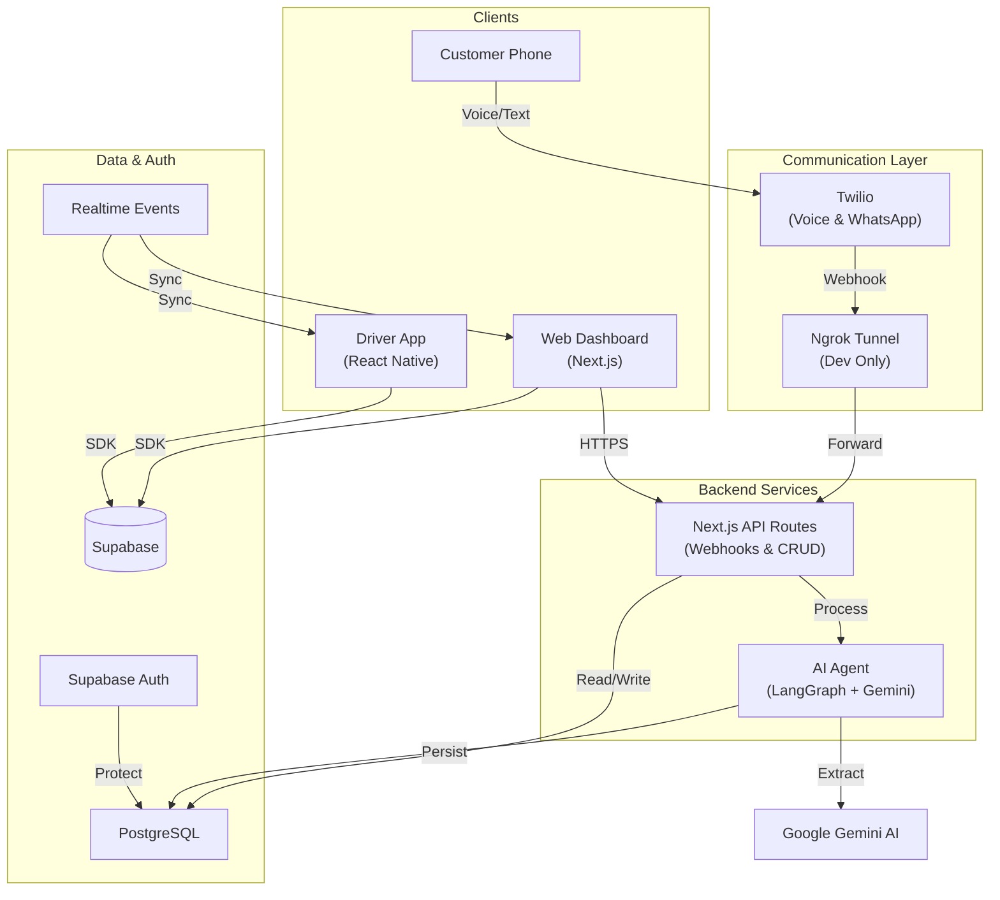
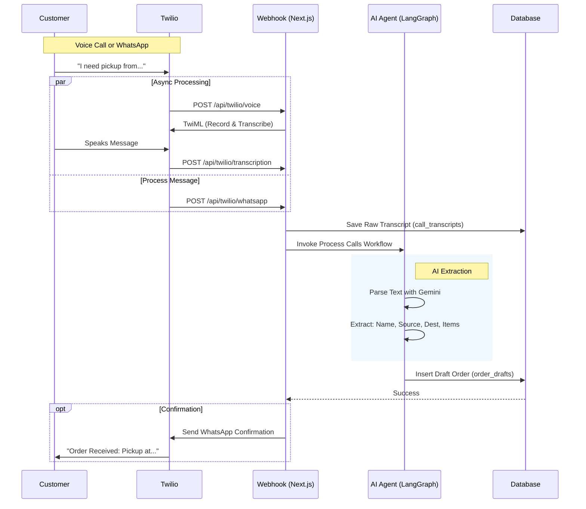
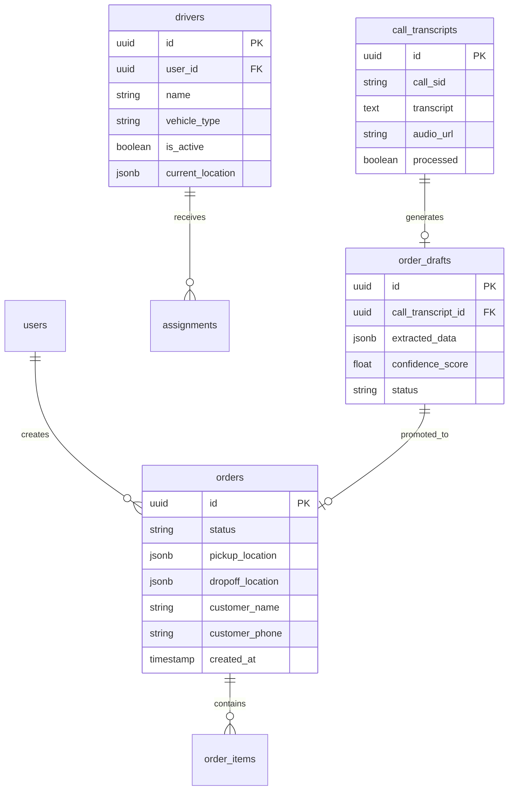

# System Design Architecture

## High-Level Overview

This system is a **Voice-First Logistics Platform** designed to automate order intake via phone calls and WhatsApp, manage orders via a web dashboard, and coordinate deliveries via a driver mobile app.

---

## Order Ingestion Pipeline

The core automated feature is the AI-driven order intake pipeline.

---

## Database Schema (Core Tables)

---

## Monorepo Structure (Turborepo)

The project is organized as a monorepo for shared code and type safety.

- **`apps/`**
    - **`web`**: Main Next.js application (Admin Dashboard + API Webhooks).
    - **`driver`**: React Native (Expo) app for drivers.
- **`packages/`**
    - **`ui`**: Shared UI library (shadcn/ui based components).
    - **`shared`**: Shared logic, Supabase client authentication, Zod schemas, TypeScript types.
    - **`langgraph`**: AI Agent logic, separate from UI for modularity.

## Key Technologies

- **Frontend**: Next.js 15 (App Router), React, TailwindCSS, Lucide Icons.
- **Mobile**: React Native, Expo.
- **Backend**: Next.js API Routes, LangGraph, Google Gemini Pro.
- **Database**: Supabase (PostgreSQL), Supabase Auth, Row Level Security (RLS).
- **Infrastucture**: Vercel (Web deployment), Ngrok (Local development tunneling).
