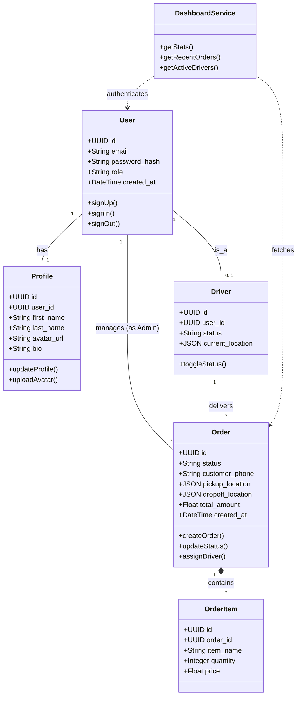

# Sprint 1 Class Diagram

This diagram represents the classes and relationships derived from the User Stories (SYS-01 to SYS-05) and Tasks (S1-1 to S1-12) identified in the Sprint 1 Planning.

## Key Entities Description

1.  **User**: Represents the central actor (Admin, Dispatcher, Driver). Handles authentication logic (S1-1, S1-2).
2.  **Profile**: Stores extended user information like bio and avatar, separate from the core auth credentials (S1-5, S1-6).
3.  **Order**: The core business entity. Even though full order processing is later, the schema and basic ingestion are part of Sprint 1 (SYS-05, S1-6).
4.  **Driver**: Initial structure required for the database schema setup in Sprint 1, linked to Users.
5.  **DashboardService**: Represents the collection of API logic connecting the backend to the Dashboard UI (S1-4).
