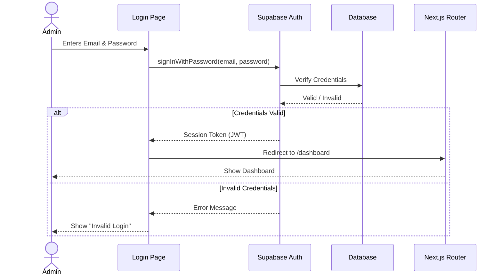
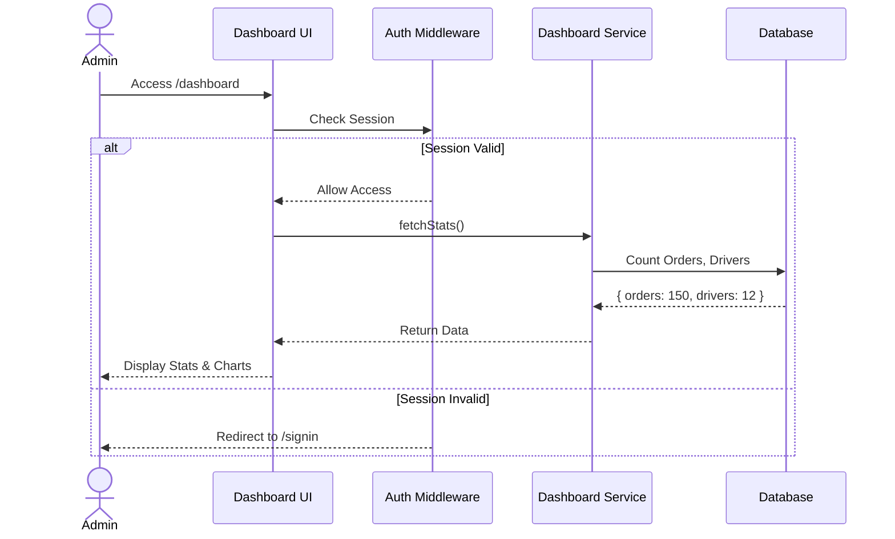
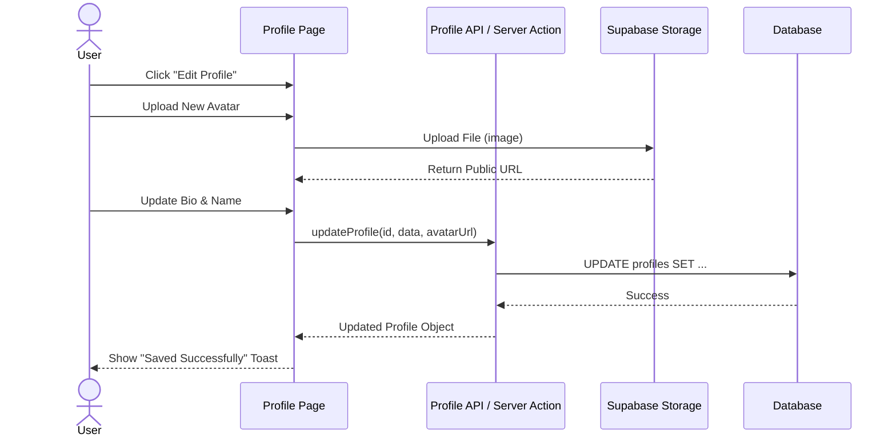
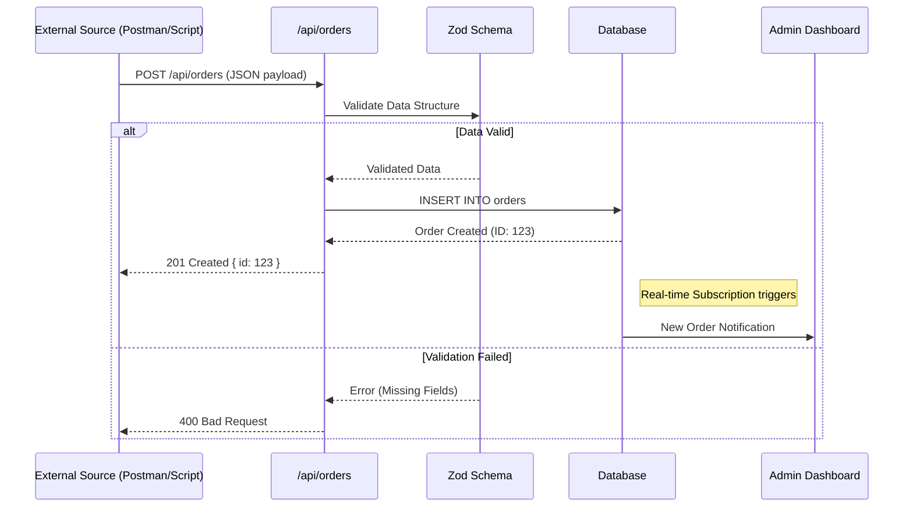

# Sprint 1 Sequence Diagrams

This document outlines the interaction flows for the User Stories implemented in Sprint 1.

## SYS-01: Admin Sign In
**As an Admin, I can sign in securely so that I can access the management dashboard.**

## SYS-02: Dashboard Overview
**As an Admin, I can view a dashboard overview so that I can navigate to different sections.**

## SYS-03: Profile Management
**As a User, I can manage my profile settings so that my information is up to date.**

## SYS-05: external Order Ingestion
**As a System, I can ingest order data from external sources so that the system works end-to-end.**

> **Note on SYS-04 (Database Schema):**
> User Story SYS-04 refers to the structural setup of the database (Table creation, RLS policies). This is best represented by the ERD or Class Diagram and does not have a runtime sequence flow closer than "Dev runs migration -> DB applies changes".
